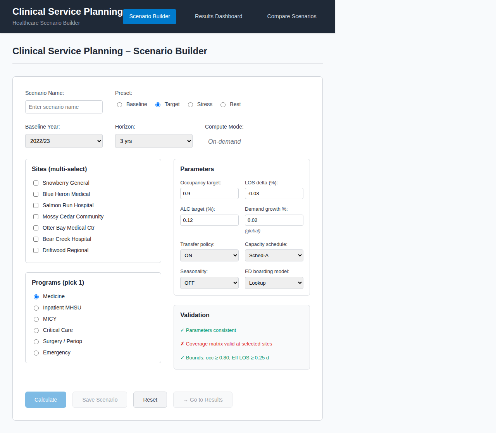
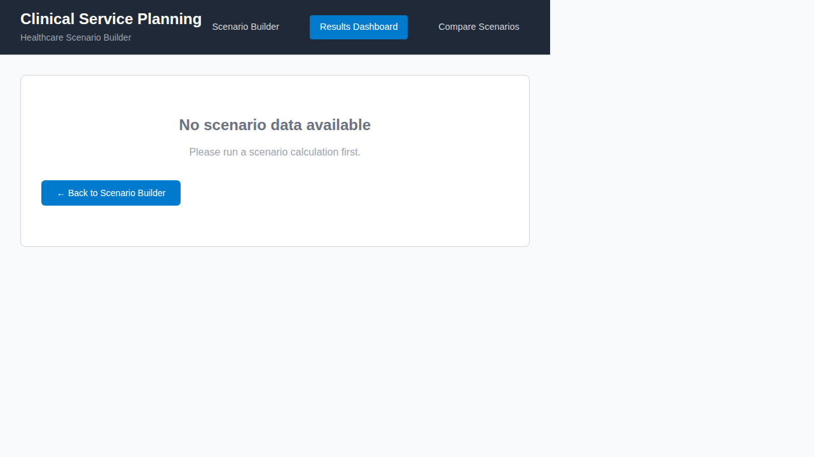
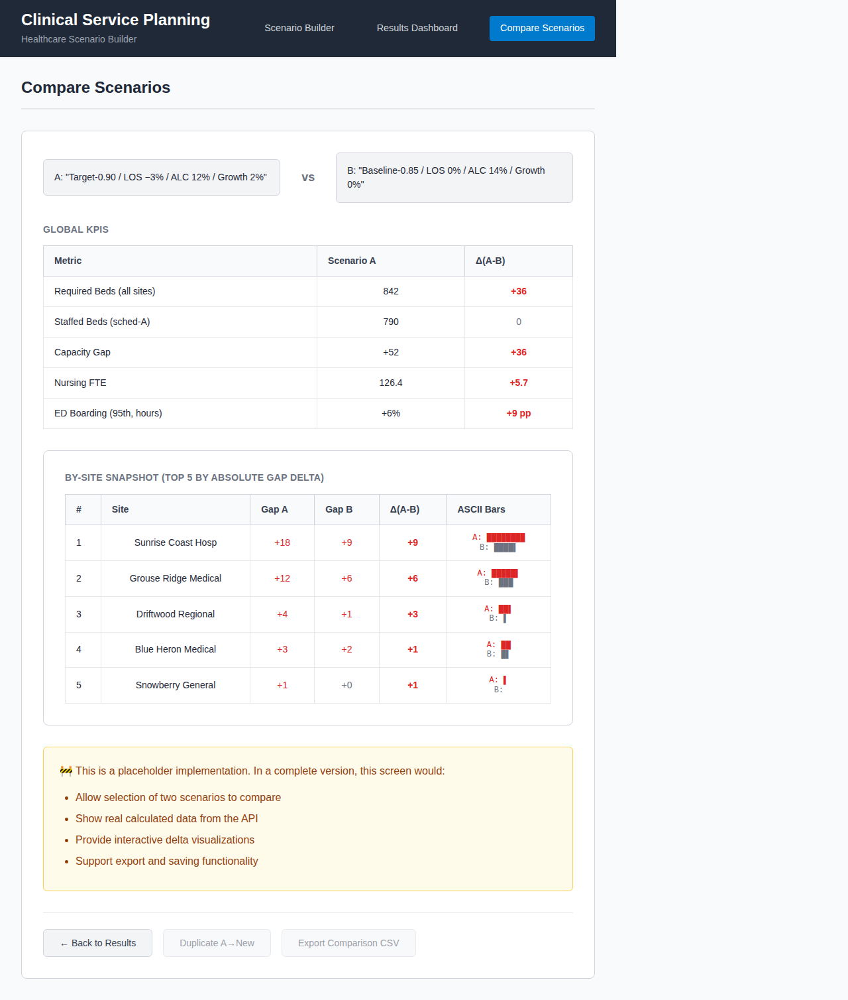

# Synthetic Healthcare Database

**⚠️ This data is entirely synthetic and fictional, generated for non-production testing and development purposes only.**

This project creates and populates a MySQL database with synthetic healthcare data for a fictional Lower Mainland hospital network. The data includes facilities, patients, emergency department encounters, inpatient stays, and population projections.

## Table of Contents

- [Quick Start](#quick-start)
  - [Environment Setup](#environment-setup) 
  - [Docker & GitHub Codespaces Setup](#docker--github-codespaces-setup)
  - [Prerequisites](#prerequisites)
  - [Setup Options](#setup-options)
- [Verifying Your Setup](#verifying-your-setup)
- [Database Schema](#database-schema)
- [Sample Data Characteristics](#sample-data-characteristics)
- [Sample Queries](#sample-queries)
- [REST API](#rest-api)
- [Frontend Application](#frontend-application)
- [Command Line Interface](#command-line-interface)
- [Customization](#customization)
- [SDV Synthetic Data Generation](#sdv-synthetic-data-generation)
- [Data Quality & Validation](#data-quality--validation)
- [Privacy & Compliance](#privacy--compliance)
- [Troubleshooting](#troubleshooting)
- [Development](#development)

## Quick Start

### 🧙 **New! Interactive Setup Wizard (Recommended for Beginners)**

The **easiest way** to get started is using our brand-new interactive setup wizard:

```bash
# Clone the repository
git clone https://github.com/AndrewMichael2020/sample-hospital-network.git
cd sample-hospital-network

# Install dependencies
pip install -r requirements.txt

# Run the interactive setup wizard
python cli.py setup-wizard
```

The wizard will:
- ✅ **Detect your environment** automatically (Docker, MySQL, OS, etc.)
- 🎯 **Recommend the best setup method** for your system
- 📋 **Guide you step-by-step** through configuration with clear explanations
- 🎨 **Provide a colorful, user-friendly interface** with progress tracking
- ⚡ **Automate the entire setup process** including dependencies, data generation, and database setup

**For automated/scripted setups:**
```bash
# Quick API-only setup (no database required)
python cli.py setup-wizard --auto --method api --patients 1000

# Quick Docker setup
python cli.py setup-wizard --auto --method docker --patients 5000
```

📚 **[Complete Setup Guide](docs/SETUP_GUIDE.md)** - Detailed documentation with screenshots and troubleshooting

---

### Alternative Setup Methods

If you prefer manual setup or want to understand the process, choose one of the following options:

### Environment Setup

Before getting started, you'll need to configure your environment:

1. **Copy the environment template:**
   ```bash
   cp .env.example .env
   ```

2. **Edit `.env` with your MySQL credentials:**
   ```bash
   # For local MySQL installation
   MYSQL_HOST=localhost
   MYSQL_PORT=3306
   MYSQL_USER=root
   MYSQL_PASSWORD=your_mysql_password
   MYSQL_DATABASE=lm_synth
   ```

3. **For Docker/GitHub Codespaces users:** The default values in `.env.example` work out-of-the-box with the provided Docker setup.

   > **Note:** The `.env` file is automatically ignored by git (see `.gitignore`) so your credentials stay secure.

### Docker & GitHub Codespaces Setup

#### Option A: GitHub Codespaces (Recommended for beginners)
1. **Open in GitHub Codespaces:** Click the "Code" button → "Codespaces" → "Create codespace on main"
2. **Wait for setup:** The devcontainer will automatically:
   - Set up MySQL database
   - Install Python dependencies  
   - Generate initial sample data
   - Start the API server on port 8000
3. **Access the API:** Once setup completes, the API will be available at the forwarded port URL

#### Option B: Local Docker Compose  
```bash
# Copy environment file and customize if needed
cp .env.example .env

# Start all services (MySQL + API)
docker compose up -d

# Generate sample data (first time only)
docker compose exec app python generate_data.py

# Load data into MySQL (first time only)
docker compose exec app python load_data.py

# Access API at: http://localhost:8000/docs
```

### Prerequisites

Choose one of the following setups:

#### For GitHub Codespaces (Easiest)
- GitHub account with Codespaces access
- No local setup required!

#### For Docker (Local Development)
- Docker and Docker Compose installed
- 4GB+ RAM available for containers

#### For Native/Manual Setup
- Python 3.8+
- MySQL 8.0+ (running and accessible)
- Basic MySQL user with database creation privileges

### Setup Options

**Choose the option that best fits your needs:**
- 🚀 **Option 1** (Codespaces): Perfect for quick experimentation, no local setup required
- 🐳 **Option 2** (Docker): Best for local development, consistent environment  
- ⚡ **Option 3** (Automated): Fastest if you already have MySQL running locally
- 🔧 **Option 4** (Manual): Maximum control, understand each step
- 📊 **Option 5** (API Only): Just want to explore the REST API
- 💻 **Option 6** (CLI Only): Command-line data generation and management
- 🧪 **Option 7** (SDV): Advanced users wanting realistic synthetic data correlations

#### Option 1: GitHub Codespaces (Recommended)
See the "Docker & GitHub Codespaces Setup" section above.

#### Option 2: Docker Compose (Local Development)
See the "Docker & GitHub Codespaces Setup" section above.

#### Option 3: Automated Native Setup
```bash
# Install dependencies and run complete setup
pip install -r requirements.txt
python setup.py

# Or with custom MySQL connection
python setup.py --host localhost --user myuser --password mypass
```

#### Option 4: Manual Native Setup
```bash
# 1. Install dependencies
make setup

# 2. Create database schema
mysql -e "CREATE DATABASE IF NOT EXISTS lm_synth CHARACTER SET utf8mb4 COLLATE utf8mb4_0900_ai_ci;"
mysql lm_synth < schema.sql

# 3. Generate sample data
make generate

# 4. Load data into MySQL
make load
```

#### Option 5: API Server Only
```bash
# Start REST API server with data generation
make api-start

# Or use CLI
python cli.py serve --host localhost --port 8000

# Access API documentation at: http://localhost:8000/docs
```

#### Option 6: Command Line Interface
```bash
# Use the CLI for data management
python cli.py --help
python cli.py generate --patients 5000 --seed 42
python cli.py validate --data-dir ./data
python cli.py status
```

#### Option 7: Advanced SDV Synthetic Data Generation
```bash
# Generate advanced synthetic data with higher-order correlations
make sdv-pipeline    # Complete: train model, generate data, validate

# Individual steps:
make sdv-train      # Train HMA1 model on seed data  
make sdv-generate   # Generate larger synthetic datasets
make sdv-validate   # Validate data quality and privacy

# See sdv_models/README.md for detailed SDV documentation
```

## Verifying Your Setup

After following any of the setup options above, you can verify everything is working:

### Test Data Generation
```bash
# Check if sample data was created
ls -la data/
# Should show: patients.csv, ed_encounters.csv, dim_site.csv, etc.

# Verify data content
head data/patients.csv
```

### Test API Server (if using API options)
```bash
# Health check
curl http://localhost:8000/health

# Browse interactive docs
open http://localhost:8000/docs  # or visit in browser

# Test a data endpoint
curl "http://localhost:8000/api/v1/dimensions/sites?page=1&size=5"
```

### Test CLI Commands
```bash
# Check system status
python cli.py status

# Generate fresh data with custom parameters
python cli.py generate --patients 500 --seed 123

# Validate data quality
python cli.py validate --data-dir ./data
```

## Database Schema

The database contains the following tables:

### Dimension Tables
- **dim_site**: 12 fictional hospital facilities (e.g., "Snowberry General", "Blue Heron Medical")
- **dim_program**: 16 healthcare programs (Medicine, Surgery, Emergency, etc.)  
- **dim_subprogram**: 3 subprograms for each program
- **dim_lha**: 12 fictional Local Health Areas mapped to default facilities

### Reference Tables
- **population_projection**: Population forecasts by year (2025-2034), LHA, age group, and gender
- **ed_baseline_rates**: Emergency department utilization rates per 1000 population

### Fact Tables
- **patients**: ~1000 synthetic patients with demographics and home facilities
- **ed_encounters**: Emergency department visits with timestamps, acuity, disposition
- **ip_stays**: Inpatient stays with length of stay, programs, ALC flags

## Sample Data Characteristics

- **Facilities**: 12 fictional Lower Mainland hospitals with codes like LM-SNW, LM-BLH
- **LHAs**: 12 fictional areas like "Harborview", "Riverbend", "Cedar Heights"
- **Patients**: 1000 synthetic patients with realistic age/gender distributions
- **Encounters**: ~2000 ED visits with age-appropriate service assignment
- **Geography**: 90% of care occurs at patients' home facility, 10% cross-boundary care

### Age Group Distribution
- Pediatric ED encounters concentrated in 0-14 age groups
- Adult ED encounters predominantly 25+ age groups  
- Elderly (75+) patients have higher ED rates and longer inpatient stays

## Sample Queries

### Facility Summary
```sql
SELECT site_code, site_name, COUNT(p.patient_id) as patient_count
FROM dim_site s
LEFT JOIN patients p ON s.site_id = p.facility_home_id  
GROUP BY s.site_id, s.site_code, s.site_name
ORDER BY patient_count DESC;
```

### ED Volume Projection for 2025
```sql
SELECT s.site_code AS facility,
       r.ed_subservice,
       ROUND(SUM(p.population * r.baserate_per_1000 / 1000.0), 0) AS projected_volumes
FROM population_projection p
JOIN ed_baseline_rates r
  ON p.lha_id=r.lha_id AND p.age_group=r.age_group AND p.gender=r.gender
JOIN dim_lha l ON l.lha_id=p.lha_id
JOIN dim_site s ON s.site_id=l.default_site_id
WHERE p.year=2025
GROUP BY s.site_code, r.ed_subservice
ORDER BY projected_volumes DESC;
```

### Patient Demographics
```sql
SELECT age_group, gender, COUNT(*) as patient_count
FROM patients 
GROUP BY age_group, gender
ORDER BY age_group, gender;
```

## File Structure

```
.
├── requirements.txt          # Python dependencies (including FastAPI, Typer)
├── schema.sql               # MySQL DDL for all tables
├── generate_data.py         # Creates synthetic data as CSV files
├── load_data.py            # Loads CSV files into MySQL
├── setup.py               # Automated setup script
├── api.py                # REST API server (FastAPI)
├── api_models.py         # Pydantic models for API validation
├── cli.py               # Command Line Interface (Typer)
├── Makefile            # Build automation (includes API targets)
├── README.md          # This documentation
├── sdv_models/        # SDV synthetic data generation
│   ├── metadata.json    # Multi-table schema definitions
│   ├── constraints.py   # Business rules and data validation
│   ├── train.py        # HMA1/CTGAN model training
│   ├── validate.py     # Quality gates and privacy checks
│   └── README.md       # SDV usage documentation
└── data/               # Generated CSV files
    ├── dim_site.csv
    ├── dim_program.csv
    ├── patients.csv
    ├── ed_encounters.csv
    ├── synthetic/      # SDV-generated synthetic data
    │   ├── patients_synthetic.csv
    │   ├── ed_encounters_synthetic.csv
    │   └── ip_stays_synthetic.csv
    └── ...
```

## REST API

The system now includes a comprehensive REST API built with FastAPI that provides programmatic access to all synthetic healthcare data.

### API Features

- **Instruction 00**: Pydantic models for data validation and configuration
- **Instruction 01**: Dimension data endpoints (facilities, programs, LHAs)
- **Instruction 02**: Population projections and baseline rates
- **Instruction 03**: Patient demographics and medical encounters
- Automatic API documentation via Swagger/OpenAPI
- Pagination and filtering support
- Data validation and quality metrics

### API Endpoints

#### Core Endpoints
- `GET /` - API information and endpoint directory
- `GET /health` - Health check
- `GET /docs` - Interactive API documentation (Swagger UI)
- `GET /redoc` - Alternative API documentation

#### Dimension Data (Instruction 01)
- `GET /api/v1/dimensions/sites` - Hospital facilities
- `GET /api/v1/dimensions/programs` - Healthcare programs  
- `GET /api/v1/dimensions/subprograms` - Healthcare subprograms
- `GET /api/v1/dimensions/lhas` - Local Health Areas

#### Population Data (Instruction 02)
- `GET /api/v1/population/projections` - Population projections by year/LHA/demographics
- `GET /api/v1/population/ed-rates` - Emergency Department utilization rates

#### Patient Data (Instruction 03)
- `GET /api/v1/patients` - Patient demographics and information
- `GET /api/v1/encounters/ed` - Emergency Department encounters
- `GET /api/v1/encounters/ip` - Inpatient stays

#### Validation
- `GET /api/v1/validation/summary` - Data validation and quality metrics

### API Usage Examples

```bash
# Get first 10 hospital facilities
curl "http://localhost:8000/api/v1/dimensions/sites?page=1&size=10"

# Get patients filtered by age group and facility
curl "http://localhost:8000/api/v1/patients?age_group=25-44&facility_id=1&page=1&size=20"

# Get population projections for 2025
curl "http://localhost:8000/api/v1/population/projections?year=2025&page=1&size=50"

# Get ED encounters for a specific patient
curl "http://localhost:8000/api/v1/encounters/ed?patient_id=P5A684D41E14C"

# Validate data quality
curl "http://localhost:8000/api/v1/validation/summary"
```

## Frontend Application

A modern React-based web application provides an intuitive interface for healthcare scenario planning and capacity analysis.

### Technology Stack

- **React 19** with TypeScript for type-safe development
- **Vite** for fast development and optimized builds
- **React Router** for client-side navigation
- **TanStack Query** for efficient API data fetching and caching
- **TanStack Table** for advanced data tables
- **Recharts** for data visualization and charts
- **Zod** for runtime type validation
- **Vitest** with Testing Library for comprehensive testing

### Getting Started

1. **Navigate to the frontend directory:**
   ```bash
   cd apps/frontend
   ```

2. **Install dependencies:**
   ```bash
   npm install
   ```

3. **Start the development server:**
   ```bash
   npm run dev
   ```

4. **Open your browser to:**
   ```
   http://localhost:5173
   ```

### Application Features

The frontend provides three main screens:

#### Scenario Builder
Interactive form for creating healthcare capacity scenarios with:
- Site and program selection
- Parameter configuration (occupancy targets, LOS deltas, ALC targets)
- Real-time validation and error checking
- Preset scenario templates (Baseline, Target, Stress, Best)



#### Results Dashboard  
Comprehensive view of scenario calculations featuring:
- Key Performance Indicators (KPIs) cards
- Capacity gaps and FTE requirements
- Site-by-site analysis with data tables
- Interactive charts and visualizations



#### Scenario Comparison
Side-by-side comparison of different scenarios with:
- Delta analysis between scenarios
- ASCII bar charts for visual comparison
- Export functionality for reports



### Testing

The frontend includes comprehensive test coverage with **27 passing tests** across multiple categories:

- **Component Tests**: UI components (KpiCard, Loading, etc.)
- **Utility Tests**: Formatting and validation functions  
- **Integration Tests**: End-to-end user workflows

**Run the test suite:**
```bash
# Run all tests
npm test

# Run tests with verbose output
npm test -- --reporter=verbose

# Run tests in watch mode for development
npm run test:ui
```

**Latest Test Results:**
```
✓ src/lib/format.test.ts (15 tests) - Format & validation utilities
✓ src/components/KpiCard.test.tsx (7 tests) - KPI display component
✓ src/components/Loading.test.tsx (5 tests) - Loading state component

Test Files  3 passed (3)
Tests      27 passed (27)
Duration   1.17s
```

### Development Workflow

1. **Lint code:**
   ```bash
   npm run lint
   ```

2. **Build for production:**
   ```bash
   npm run build
   ```

3. **Preview production build:**
   ```bash
   npm run preview
   ```

4. **Run end-to-end tests:**
   ```bash
   npm run e2e
   ```

The frontend integrates seamlessly with the REST API (runs on port 8080) to provide real-time healthcare capacity planning capabilities.

## Command Line Interface

A comprehensive CLI built with Typer provides easy data management and API control:

```bash
# Generate data with custom parameters
python cli.py generate --patients 5000 --seed 42 --format csv

# Validate data quality
python cli.py validate --data-dir ./data --output validation.json

# Start API server  
python cli.py serve --host 0.0.0.0 --port 8000 --reload

# Check system status
python cli.py status

# Clean generated data
python cli.py clean --data-dir ./data
```

## Customization

### Generating More/Fewer Patients
Edit `generate_data.py` and change the `n_patients` parameter in the `main()` function, or modify the script to accept command line arguments.

### Different Growth Rates
Modify the population projection logic in `generate_population_projection()` to adjust annual growth rates by LHA.

### Additional Programs
Add more programs to the `PROGRAMS` constant and corresponding subprograms to `SUBPROGRAMS`.

## SDV Synthetic Data Generation

This project includes advanced synthetic data generation using **SDV (Synthetic Data Vault)** to establish higher-order correlations between tables and generate more realistic multi-table datasets.

### Key Features
- **Multi-table relationships**: Maintains referential integrity between Patients, ED_Encounters, and IP_Stays
- **Business rule enforcement**: Age/DOB consistency, LOS constraints, pediatric ED rules
- **Privacy validation**: K-anonymity checks, quasi-identifier uniqueness
- **Quality metrics**: Statistical similarity validation and correlation preservation

### Quick SDV Usage
```bash
# Generate advanced synthetic data (2000+ patients with realistic correlations)
make sdv-pipeline

# Train custom model with specific parameters  
python sdv_models/train.py --model-type hma --epochs 200 --patients 5000

# Generate from existing model
python sdv_models/train.py --generate-only --patients 10000

# Validate quality and privacy
python sdv_models/validate.py --strict
```

For detailed SDV documentation, see [`sdv_models/README.md`](sdv_models/README.md).

## Data Quality & Validation

The generated data includes:
- ✅ Consistent foreign key relationships
- ✅ Age-appropriate service assignments (pediatric vs adult ED)
- ✅ Realistic length of stay distributions
- ✅ Higher ALC rates for elderly and medicine patients
- ✅ Seasonal and demographic variation in utilization rates

## Privacy & Compliance

- **All data is completely synthetic** - no real patient information
- Facility names and LHA names are entirely fictional
- Patient IDs are randomly generated UUIDs
- No real addresses, names, or identifiable information

## Troubleshooting

### Environment Variables
If you're having configuration issues:
```bash
# Check if .env file exists and has correct values
cat .env

# Copy fresh template if needed  
cp .env.example .env
```

### GitHub Codespaces Issues
- **Port not accessible:** Wait for the postCreateCommand to finish (check terminal output)
- **Database connection failed:** Restart the codespace or rebuild the container
- **API not starting:** Check the logs with `docker-compose logs app`

### Docker Issues  
```bash
# Check if services are running
docker compose ps

# View logs for troubleshooting
docker compose logs mysql
docker compose logs app

# Restart services if needed
docker compose down
docker compose up -d
```

### Native MySQL Issues
```bash
# Test MySQL connectivity
mysql -h localhost -u root -p -e "SELECT 1;"

# Check if database exists
mysql -h localhost -u root -p -e "SHOW DATABASES LIKE 'lm_synth';"

# Reset database if needed
mysql -h localhost -u root -p -e "DROP DATABASE IF EXISTS lm_synth;"
python setup.py  # Will recreate database
```

### Missing Data Files
```bash
# Clean and regenerate data files
make clean
make generate

# Or use CLI with custom parameters
python cli.py clean --data-dir ./data
python cli.py generate --patients 1000 --seed 42
```

### API Not Starting
```bash
# Check if port is already in use
lsof -i :8000

# Try different port
python cli.py serve --port 8001

# Check Python path and dependencies
python -c "import fastapi, uvicorn; print('FastAPI ready')"
```

### MySQL Connection Issues
```bash
# Test MySQL connectivity
mysql -h localhost -u root -p -e "SELECT 1;"

# Check if database exists
mysql -h localhost -u root -p -e "SHOW DATABASES LIKE 'lm_synth';"
```

### Foreign Key Constraint Errors
The loading order matters due to foreign key relationships. The `load_data.py` script loads tables in the correct dependency order.

## Development

### Running Tests
```bash
make test
```

### Generate Small Dataset
```bash
# Modify generate_data.py for fewer patients for faster testing
python -c "
import generate_data
# Edit the main() function call to use fewer patients
"
```

---

**Note**: This is synthetic data for development and testing purposes only. Do not use in production environments or for real healthcare decisions.